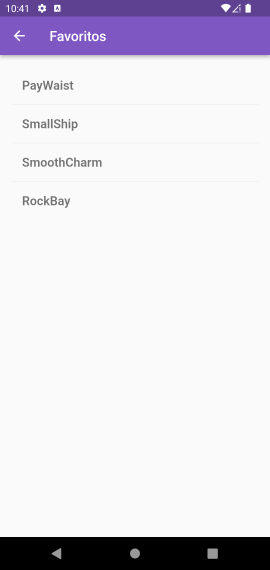

# Primeiro App em Flutter

Aplicativo simples que gera nomes aleatórios para uma empresa iniciante. O usuário pode selecionar e desmarcar nomes, salvando os melhores. O código gera 10 nomes por vez.

[**Link do projeto na Doc. do Flutter.**](https://docs.flutter.dev/get-started/codelab)

### HomePage do App  

  

### Adicionando nomes a seção de Favoritos.

  

### Favoritos  

  
